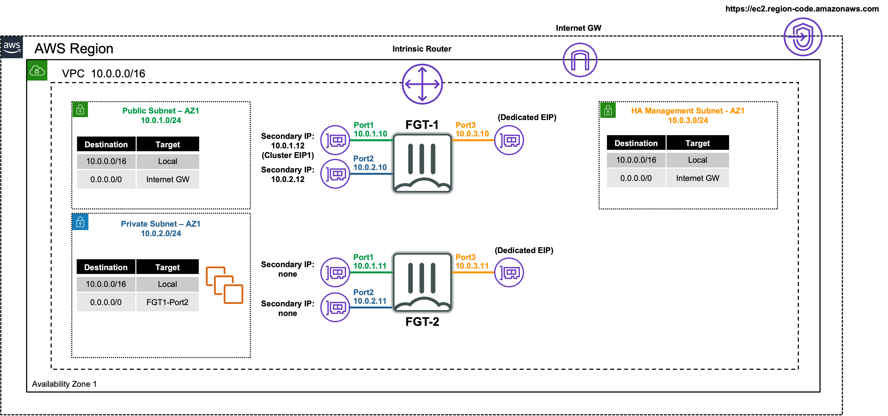
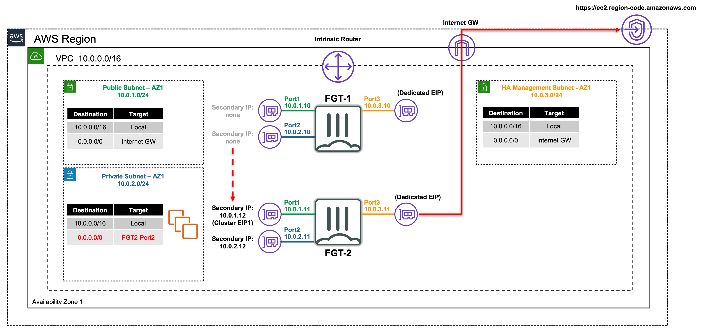

## Welcome

The purpose of this site is to provide a quick start guide for using Infrastructure as Code (IaC) templates located in the repo [**fortigate-aws-ha-singleaz-cloudformation**](https://github.com/FortinetCloudCSE/fortigate-aws-ha-singleaz-cloudformation).

Reference the prerequisites and deployment sections on this site to get started.

For detailed documentation on FGCP in AWS, walk through of a post deployment failover, and additional use cases, please reference [**CSE Team FGCP in AWS**](https://fortinetcloudcse.github.io/FGCP-in-AWS).

For other documentation needs such as FortiOS administration, please reference [**docs.fortinet.com**](https://docs.fortinet.com/). 
